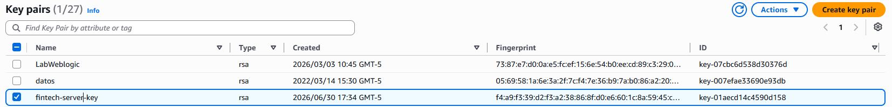
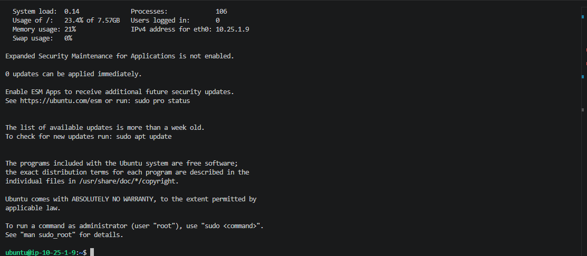
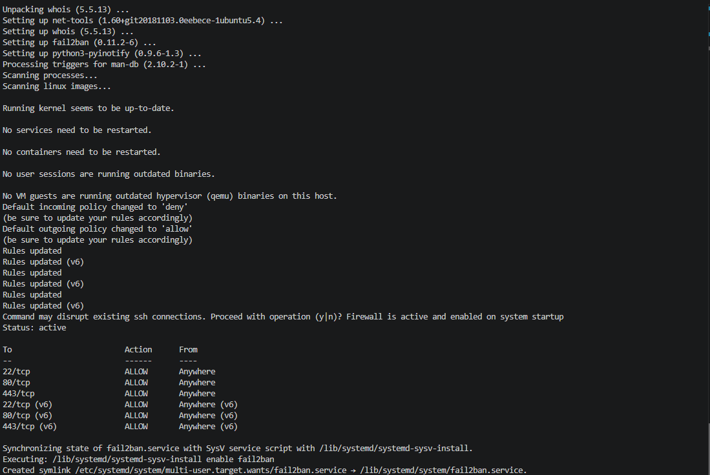
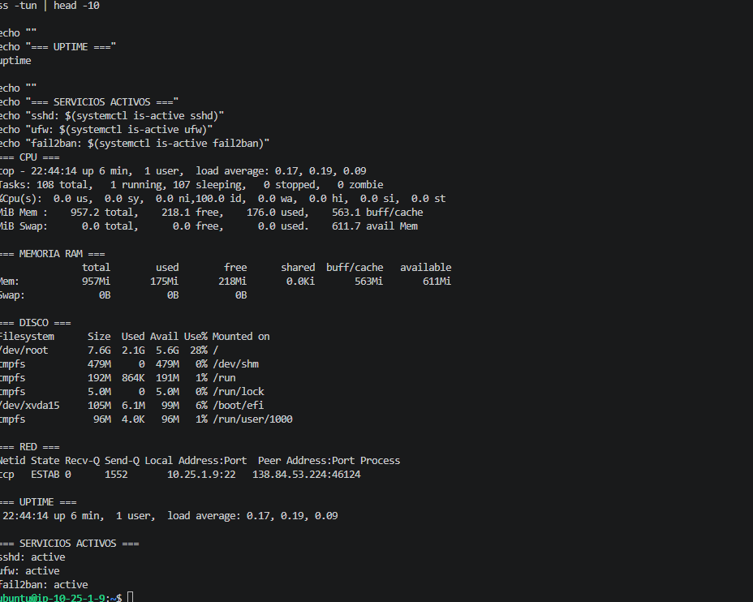
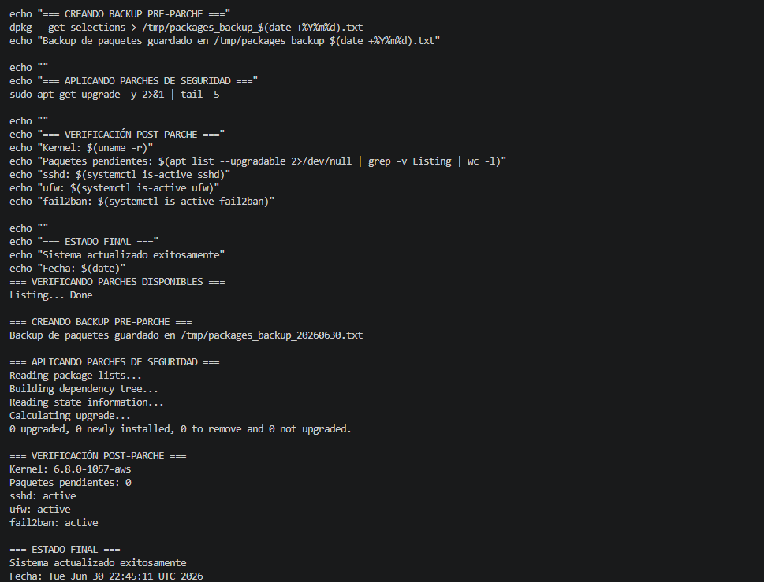

# Documentación del Proceso - Gestión de Servidores Remotos

## Información del Reto

| Campo | Valor |
|-------|-------|
| **Tema** | Manejo de infraestructura |
| **Nivel** | junior-l2 |
| **Tipo** | practical |
| **Participante** | Judith Castro |
| **Fecha** | Junio 2025 |

---

## Fase 0: Configuración del Proyecto

El proyecto base fue obtenido y verificado sin errores de sintaxis usando `bash -n` en los 3 scripts.

---

## Fase 1: Configuración Inicial del Servidor

### 1.1 Creación de la infraestructura en AWS (CLI)

Se utilizó AWS CLI con el profile `pra_kappa_lab` para crear la infraestructura:

**Crear Key Pair:**
```bash
aws ec2 create-key-pair --key-name fintech-server-key --key-type rsa --query "KeyMaterial" --output text --profile pra_kappa_lab > fintech-server-key.pem
```



**Crear Security Group:**
```bash
aws ec2 create-security-group --group-name fintech-server-sg --description "Security Group para servidor fintech - SSH y HTTP/HTTPS" --vpc-id vpc-0a713448d7c37c8ae --profile pra_kappa_lab
```

**Configurar reglas de firewall:**
```bash
aws ec2 authorize-security-group-ingress --group-id sg-08ad8f32ab059ff6b --protocol tcp --port 22 --cidr 0.0.0.0/0 --profile pra_kappa_lab
aws ec2 authorize-security-group-ingress --group-id sg-08ad8f32ab059ff6b --protocol tcp --port 80 --cidr 0.0.0.0/0 --profile pra_kappa_lab
aws ec2 authorize-security-group-ingress --group-id sg-08ad8f32ab059ff6b --protocol tcp --port 443 --cidr 0.0.0.0/0 --profile pra_kappa_lab
```

**Lanzar instancia EC2 (Ubuntu 22.04):**
```bash
aws ec2 run-instances \
  --image-id ami-0d7405d05f836d0d4 \
  --instance-type t2.micro \
  --key-name fintech-server-key \
  --security-group-ids sg-08ad8f32ab059ff6b \
  --subnet-id subnet-035ef60e7f5c33e75 \
  --associate-public-ip-address \
  --tag-specifications "ResourceType=instance,Tags=[{Key=Name,Value=fintech-server}]" \
  --profile pra_kappa_lab
```

### 1.2 Datos del servidor creado

| Campo | Valor |
|-------|-------|
| **Instance ID** | i-018c1c4ee3f89d726 |
| **IP Pública** | 44.201.227.98 |
| **IP Privada** | 10.25.1.9 |
| **Tipo** | t2.micro |
| **SO** | Ubuntu 22.04 LTS |
| **Región** | us-east-1a |
| **VPC** | vpc-cloudops |
| **Subnet** | sub-cloudops-public1 |

### 1.3 Conexión SSH al servidor

```bash
cd /c/Users/judith.castro_pragma/Documents/Ruta/challenge-a99eb9e7-527c-44f2-883f-bd752afddd0a
chmod 400 fintech-server-key.pem
ssh -i fintech-server-key.pem ubuntu@44.201.227.98
```



### 1.4 Configuración del servidor

Se ejecutaron los siguientes pasos dentro del servidor:

```bash
# Actualizar sistema operativo
sudo apt-get update -y && sudo apt-get upgrade -y

# Instalar paquetes esenciales
sudo apt-get install -y curl wget vim htop net-tools fail2ban ufw

# Configurar firewall (UFW)
sudo ufw default deny incoming
sudo ufw default allow outgoing
sudo ufw allow 22/tcp
sudo ufw allow 80/tcp
sudo ufw allow 443/tcp
echo "y" | sudo ufw enable
sudo ufw status

# Habilitar Fail2Ban (protección contra fuerza bruta)
sudo systemctl enable fail2ban
sudo systemctl start fail2ban
```

**Resultado:** Firewall activo con puertos 22, 80 y 443 habilitados. Fail2Ban activo y protegiendo el servidor.



---

## Fase 2: Monitoreo de Recursos

### 2.1 Monitoreo local en el servidor

Se verificó el estado de los recursos directamente en la EC2:

```bash
# CPU
top -b -n 1 | head -5

# Memoria RAM
free -h

# Disco
df -h

# Red
ss -tun | head -10

# Uptime
uptime

# Servicios críticos
systemctl is-active sshd ufw fail2ban
```

### Resultados del monitoreo local

| Recurso | Estado | Valor |
|---------|--------|-------|
| **CPU** | ✅ Normal | 0% uso |
| **RAM** | ✅ Normal | 175Mi / 957Mi (18%) |
| **Disco** | ✅ Normal | 2.1G / 7.6G (28%) |
| **Red** | ✅ Normal | 1 conexión SSH activa |
| **sshd** | ✅ Activo | active |
| **ufw** | ✅ Activo | active |
| **fail2ban** | ✅ Activo | active |



### 2.2 Monitoreo con Amazon CloudWatch

Se configuró CloudWatch como sistema de monitoreo en tiempo real. AWS envía métricas de la EC2 automáticamente (CPU, red, estado) sin necesidad de instalar agentes.

**Rol IAM creado para la EC2:**
```bash
# Crear rol con permisos de CloudWatch
aws iam create-role --role-name fintech-server-cloudwatch-role \
  --assume-role-policy-document file://trust-policy.json --profile pra_kappa_lab

# Asociar política de CloudWatch
aws iam attach-role-policy --role-name fintech-server-cloudwatch-role \
  --policy-arn arn:aws:iam::aws:policy/CloudWatchFullAccess --profile pra_kappa_lab

# Crear y asociar instance profile a la EC2
aws iam create-instance-profile --instance-profile-name fintech-server-profile --profile pra_kappa_lab
aws iam add-role-to-instance-profile --instance-profile-name fintech-server-profile \
  --role-name fintech-server-cloudwatch-role --profile pra_kappa_lab
aws ec2 associate-iam-instance-profile --instance-id i-018c1c4ee3f89d726 \
  --iam-instance-profile Name=fintech-server-profile --profile pra_kappa_lab
```

### 2.3 Alarmas de CloudWatch configuradas

Se crearon alarmas para alertas tempranas en caso de sobrecarga:

```bash
# Alarma de CPU alta (>80% por más de 10 minutos)
aws cloudwatch put-metric-alarm --alarm-name "fintech-server-cpu-alta" \
  --metric-name CPUUtilization --namespace AWS/EC2 \
  --statistic Average --period 300 --threshold 80 \
  --comparison-operator GreaterThanThreshold --evaluation-periods 2 \
  --dimensions Name=InstanceId,Value=i-018c1c4ee3f89d726 \
  --alarm-description "Alerta: CPU supera el 80%" --profile pra_kappa_lab

# Alarma de tráfico de red excesivo (>50MB en 5 min)
aws cloudwatch put-metric-alarm --alarm-name "fintech-server-network-in-alta" \
  --metric-name NetworkIn --namespace AWS/EC2 \
  --statistic Average --period 300 --threshold 50000000 \
  --comparison-operator GreaterThanThreshold --evaluation-periods 2 \
  --dimensions Name=InstanceId,Value=i-018c1c4ee3f89d726 \
  --alarm-description "Alerta: Trafico de red entrante excesivo" --profile pra_kappa_lab

# Alarma de status check (servidor caído)
aws cloudwatch put-metric-alarm --alarm-name "fintech-server-status-check" \
  --metric-name StatusCheckFailed --namespace AWS/EC2 \
  --statistic Maximum --period 60 --threshold 1 \
  --comparison-operator GreaterThanOrEqualToThreshold --evaluation-periods 2 \
  --dimensions Name=InstanceId,Value=i-018c1c4ee3f89d726 \
  --alarm-description "Alerta: El servidor fallo el status check" --profile pra_kappa_lab
```

### Resumen de alarmas

| Alarma | Métrica | Umbral | Descripción |
|--------|---------|--------|-------------|
| `fintech-server-cpu-alta` | CPUUtilization | > 80% por 10 min | Alerta temprana de sobrecarga |
| `fintech-server-network-in-alta` | NetworkIn | > 50MB en 5 min | Posible ataque DDoS o tráfico anómalo |
| `fintech-server-status-check` | StatusCheckFailed | ≥ 1 por 2 min | Servidor caído o inaccesible |


### Métricas monitoreadas en CloudWatch (automáticas)

| Métrica | Descripción | Frecuencia |
|---------|-------------|------------|
| CPUUtilization | Uso de CPU del servidor | Cada 5 min |
| NetworkIn | Bytes de tráfico entrante | Cada 5 min |
| NetworkOut | Bytes de tráfico saliente | Cada 5 min |
| StatusCheckFailed | Estado de salud de la instancia | Cada 1 min |
| DiskReadOps | Operaciones de lectura en disco | Cada 5 min |
| DiskWriteOps | Operaciones de escritura en disco | Cada 5 min |

---

## Fase 3: Aplicación de Parches de Seguridad

Se implementó un proceso seguro de parcheo con los siguientes pasos:

### 3.1 Verificación de parches disponibles

```bash
sudo apt list --upgradable
```

### 3.2 Backup pre-parche

```bash
dpkg --get-selections > /tmp/packages_backup_$(date +%Y%m%d).txt
```

### 3.3 Aplicación de parches

```bash
sudo apt-get upgrade -y
```

### 3.4 Verificación post-parche

```bash
echo "Kernel: $(uname -r)"
echo "Paquetes pendientes: $(apt list --upgradable 2>/dev/null | grep -v Listing | wc -l)"
echo "sshd: $(systemctl is-active sshd)"
echo "ufw: $(systemctl is-active ufw)"
echo "fail2ban: $(systemctl is-active fail2ban)"
```

**Resultado:** Sistema actualizado, 0 parches pendientes, todos los servicios activos.



---

## Arquitectura Implementada

```
┌─────────────────────────────────────────────────┐
│                    AWS Cloud                      │
│  ┌───────────────────────────────────────────┐  │
│  │         VPC: vpc-cloudops                  │  │
│  │         CIDR: 10.25.0.0/16               │  │
│  │  ┌─────────────────────────────────────┐  │  │
│  │  │   Subnet: sub-cloudops-public1       │  │  │
│  │  │   AZ: us-east-1a                    │  │  │
│  │  │                                      │  │  │
│  │  │   ┌──────────────────────────────┐  │  │  │
│  │  │   │  EC2: fintech-server         │  │  │  │
│  │  │   │  IP: 44.201.227.98           │  │  │  │
│  │  │   │  OS: Ubuntu 22.04           │  │  │  │
│  │  │   │  Type: t2.micro              │  │  │  │
│  │  │   │                              │  │  │  │
│  │  │   │  Servicios:                  │  │  │  │
│  │  │   │  - SSH (puerto 22)           │  │  │  │
│  │  │   │  - UFW (firewall)            │  │  │  │
│  │  │   │  - Fail2Ban (anti-brute)     │  │  │  │
│  │  │   └──────────────────────────────┘  │  │  │
│  │  └─────────────────────────────────────┘  │  │
│  └───────────────────────────────────────────┘  │
│                                                  │
│  Security Group: fintech-server-sg               │
│  - Inbound: 22/tcp, 80/tcp, 443/tcp             │
│  - Outbound: All traffic                         │
└─────────────────────────────────────────────────┘
```

---

## Respuestas a Dimensiones Evaluadas

### ¿Qué es un servidor remoto y por qué es importante en una empresa fintech?
Un servidor remoto es una máquina física o virtual ubicada en un centro de datos (como AWS) que se administra a distancia mediante SSH. En una fintech es crítico porque aloja los servicios que procesan transacciones financieras, datos sensibles de clientes y debe garantizar alta disponibilidad 24/7.

### ¿Para qué sirve el monitoreo de recursos en un servidor?
Sirve para detectar problemas antes de que afecten a los usuarios: sobrecarga de CPU, memoria llena, disco agotado o conexiones anómalas. Permite tomar decisiones proactivas como escalar recursos o investigar posibles ataques.

### ¿Cómo se usa un sistema de monitoreo para mejorar la eficiencia del servidor?
Se definen umbrales de alerta (CPU>80%, RAM>85%, Disco>90%) y se revisan periódicamente. Si un recurso se acerca al umbral, se optimiza la aplicación o se escala la infraestructura antes de que haya degradación del servicio.

### ¿Cuáles son los errores comunes al aplicar parches de seguridad?
- Aplicar parches directamente en producción sin probar
- No hacer backup antes de aplicar
- No verificar que los servicios siguen funcionando después del parche
- Ignorar parches pendientes por mucho tiempo
- No tener un plan de rollback en caso de fallo

### ¿Qué decisiones implica la automatización de la aplicación de parches?
- Definir ventanas de mantenimiento para minimizar impacto
- Decidir si aplicar solo parches de seguridad o todos
- Establecer un proceso de backup obligatorio antes de cada parche
- Implementar verificación automática post-parche
- Definir criterios de rollback automático si algo falla
- Decidir si se requiere reinicio del servidor y cómo manejarlo

---

## Comandos de referencia

| Acción | Comando |
|--------|---------|
| Conectar al servidor | `ssh -i fintech-server-key.pem ubuntu@44.201.227.98` |
| Ver estado firewall | `sudo ufw status` |
| Ver uso de recursos | `htop` |
| Ver parches pendientes | `apt list --upgradable` |
| Ver logs de fail2ban | `sudo fail2ban-client status sshd` |
| Reiniciar servicio | `sudo systemctl restart <servicio>` |
